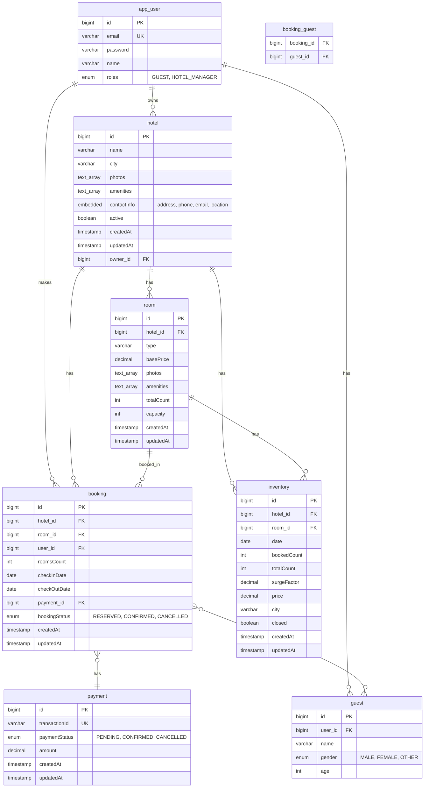

# Airbnb Clone — Backend Project Documentation

## Overview

This is the **backend** of an Airbnb-style accommodation booking application. It is a Spring Boot (Java 21) REST API that manages hotels, rooms, inventory, bookings, guests, and payments. The project is part of the **Coding Shuttle** curriculum and uses **PostgreSQL** as the database with **JPA/Hibernate** for persistence.

---

## Tech Stack

| Layer        | Technology                          |
|-------------|--------------------------------------|
| Runtime     | Java 21                             |
| Framework   | Spring Boot 3.4.0                   |
| Web         | Spring Web (REST)                   |
| Data        | Spring Data JPA, Hibernate          |
| Database    | PostgreSQL                          |
| Mapping     | ModelMapper 3.2.2                   |
| Utilities   | Lombok                              |

**Base URL:** All APIs are served under `/api/v1`.

---

## Project Structure

```
src/main/java/com/codingshuttle/projects/airBnbApp/
├── AirBnbAppApplication.java      # Entry point
├── advice/                         # Global response & exception handling
│   ├── ApiError.java
│   ├── ApiResponse.java
│   ├── GlobalExceptionHandler.java
│   └── GlobalResponseHandler.java
├── config/
│   └── MapperConfig.java          # ModelMapper bean
├── controller/
│   ├── HotelController.java       # Admin hotel CRUD
│   └── RoomAdminController.java   # Admin room CRUD (per hotel)
├── dto/
│   ├── HotelDto.java
│   └── RoomDto.java
├── entity/
│   ├── Booking.java
│   ├── Guest.java
│   ├── Hotel.java
│   ├── HotelContactInfo.java      # Embeddable (address, phone, email, location)
│   ├── Inventory.java
│   ├── Payment.java
│   ├── Room.java
│   ├── User.java                  # Table: app_user
│   └── enums/
│       ├── BookingStatus.java     # RESERVED, CONFIRMED, CANCELLED
│       ├── Gender.java            # MALE, FEMALE, OTHER
│       ├── PaymentStatus.java     # PENDING, CONFIRMED, CANCELLED
│       └── Role.java              # GUEST, HOTEL_MANAGER
├── exception/
│   ├── ForbiddenException.java
│   ├── ResourceConflictException.java
│   ├── ResourceNotFoundException.java
│   └── UnauthorizedException.java
├── repository/
│   ├── HotelRepository.java
│   ├── InventoryRepository.java
│   └── RoomRepository.java
└── service/
    ├── HotelService.java / HotelServiceImpl.java
    ├── InventoryService.java / InventoryServiceImpl.java
    └── RoomService.java / RoomServiceImpl.java
```

---

## Entity-Relationship Diagram

The diagram below shows all **entities**, their **attributes**, and **relationships**. Embedded/value types and join tables are implied where relevant.



### Relationship Summary

| From     | To        | Cardinality | Description |
|----------|-----------|-------------|-------------|
| **User** | Hotel     | 1 : N       | A user (hotel manager) can own many hotels. |
| **User** | Guest     | 1 : N       | A user can have many guest profiles. |
| **User** | Booking   | 1 : N       | A user can make many bookings. |
| **Hotel**| Room      | 1 : N       | A hotel has many rooms (cascade delete). |
| **Hotel**| Booking   | 1 : N       | A hotel has many bookings. |
| **Hotel**| Inventory | 1 : N       | A hotel has inventory records per room per date (cascade delete). |
| **Room** | Booking   | 1 : N       | A room can be part of many bookings. |
| **Room** | Inventory | 1 : N       | A room has inventory per date (cascade delete). |
| **Booking** | Payment | N : 1       | A booking can have one payment. |
| **Booking** | Guest    | N : N       | A booking can have many guests; a guest can be in many bookings (join table `booking_guest`). |

### Key Business Rules (from schema)

- **Inventory** is unique per `(hotel_id, room_id, date)` and stores `bookedCount`, `totalCount`, `surgeFactor`, and computed `price` for that date.
- **HotelContactInfo** is embedded in `Hotel` (no separate table).
- **User** table is named `app_user` (reserved word).
- Deleting a **Hotel** cascades to its **Room** and **Inventory** rows.

---

## Entity Descriptions

### User (`app_user`)
- Represents a person in the system (guest or hotel manager).
- **Roles:** `GUEST`, `HOTEL_MANAGER` (stored as a set).
- Used as hotel owner and as the user making a booking.

### Hotel
- Accommodation property: name, city, photos, amenities, embedded contact info, active flag.
- **Owner:** ManyToOne to `User`.
- **Rooms:** OneToMany to `Room`.

### HotelContactInfo (embedded)
- Address, phone number, email, location — stored inside the `hotel` table.

### Room
- Belongs to one **Hotel**. Has type, base price, photos, amenities, total count, and capacity.
- Deleted when the parent hotel is deleted.

### Inventory
- Per-room, per-date availability and pricing: `date`, `bookedCount`, `totalCount`, `surgeFactor`, `price`, `city`, `closed`.
- Unique on `(hotel_id, room_id, date)`.
- Used for availability and dynamic pricing (not yet exposed via public APIs in the current state).

### Booking
- Links **Hotel**, **Room**, and **User** with check-in/check-out dates and number of rooms.
- Has a **Payment** (optional OneToOne) and a **BookingStatus** (RESERVED, CONFIRMED, CANCELLED).
- **Guests:** ManyToMany with `Guest` via `booking_guest`.

### Guest
- Represents a guest profile: name, gender, age; optionally linked to a **User**.

### Payment
- Transaction id, status (PENDING, CONFIRMED, CANCELLED), amount, timestamps.
- Referenced by **Booking**.

---

## API Endpoints (Current State)

All endpoints are under **`/api/v1`**. Responses are wrapped in a global `ApiResponse<T>` structure with timestamp, data, and optional error.

### Admin — Hotels  
**Base path:** `GET/POST/PUT/PATCH/DELETE /api/v1/admin/hotels`

| Method   | Path            | Description                |
|----------|------------------|----------------------------|
| `POST`   | `/admin/hotels`  | Create a new hotel         |
| `GET`    | `/admin/hotels/{hotelId}` | Get hotel by ID    |
| `PUT`    | `/admin/hotels/{hotelId}` | Update hotel by ID |
| `DELETE` | `/admin/hotels/{hotelId}` | Delete hotel by ID |
| `PATCH`  | `/admin/hotels/{hotelId}` | Activate hotel     |

### Admin — Rooms (per hotel)  
**Base path:** `GET/POST/DELETE /api/v1/admin/hotels/{hotelId}/rooms`

| Method   | Path                                      | Description                    |
|----------|--------------------------------------------|--------------------------------|
| `POST`   | `/admin/hotels/{hotelId}/rooms`            | Create a new room in the hotel |
| `GET`    | `/admin/hotels/{hotelId}/rooms`            | List all rooms in the hotel    |
| `GET`    | `/admin/hotels/{hotelId}/rooms/{roomId}`   | Get room by ID                 |
| `DELETE` | `/admin/hotels/{hotelId}/rooms/{roomId}`   | Delete room by ID              |

**Note:** There are no public (non-admin) search/booking APIs exposed yet; the **Inventory**, **Booking**, **Guest**, and **Payment** entities exist in the schema and services but are not yet wired to REST controllers.

---

## Cross-Cutting Concerns

- **Global response format:** `ApiResponse<T>` with `timeStamp`, `data`, and optional `error` (see `GlobalResponseHandler`).
- **Exception handling:** `GlobalExceptionHandler` maps custom exceptions (e.g. `ResourceNotFoundException`, `ResourceConflictException`, `ForbiddenException`, `UnauthorizedException`) to appropriate HTTP status and error body.
- **DTO mapping:** Entity ↔ DTO conversion is done with **ModelMapper** (configured in `MapperConfig`).
- **Database:** PostgreSQL; `spring.jpa.hibernate.ddl-auto=update` for schema sync. Context path: `/api/v1`.

---

## Current State Summary

| Area              | Status |
|-------------------|--------|
| **Entities & DB** | ✅ All core entities (User, Hotel, Room, Inventory, Booking, Guest, Payment) and enums defined; schema created/updated via JPA. |
| **Admin Hotels**  | ✅ Full CRUD + activate (PATCH). |
| **Admin Rooms**   | ✅ Create, list, get by ID, delete (scoped by hotel). |
| **Inventory**     | ✅ Entity, repository, and service exist; no REST API yet. |
| **Booking / Guest / Payment** | ✅ Entities and relations in place; no REST APIs yet. |
| **Auth / Security** | ❌ No authentication or authorization (e.g. JWT, role checks) implemented; endpoints are open. |
| **Public APIs**   | ❌ No search, availability, or booking flows for end-users. |

This document reflects the state of the project as of the last update. For running the app, use the same database URL as in `application.properties` (e.g. `localhost:5432/airBnb`) and start the Spring Boot application.
